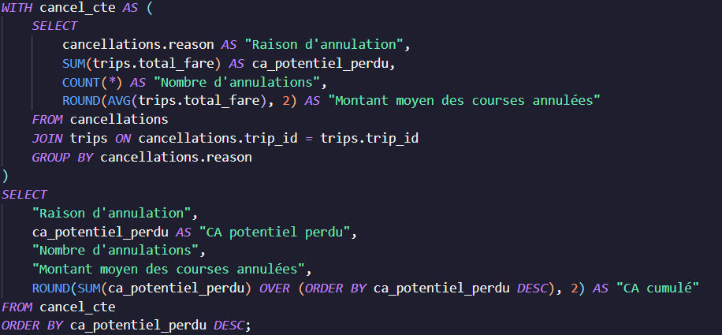
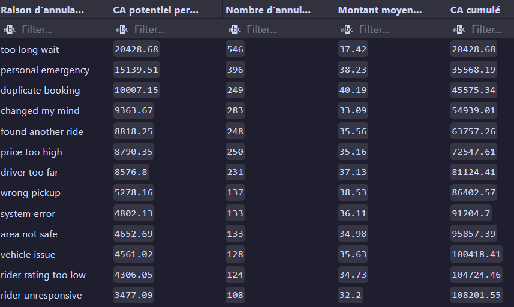
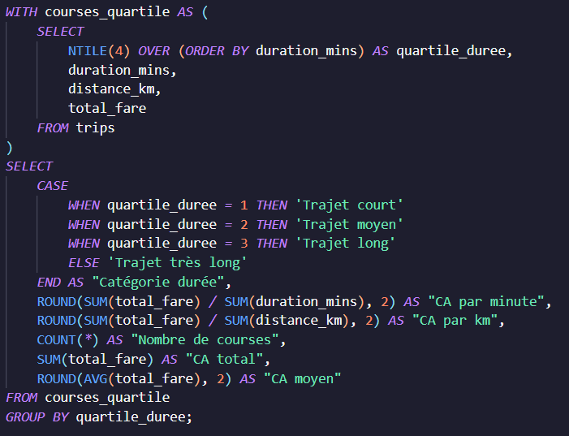
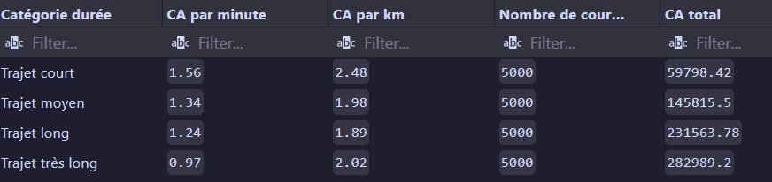

# Analyse de courses VTC (SQL)

Projet d'analyse exploratoire réalisé en SQL à partir d'une base de données simulant l'activité d'une plateforme de VTC.


## Objectifs du projet

J'ai choisi d'orienter ce projet sur une analyse ayant pour objectif de répondre aux besoins d'équipes métier.
L'objectif est donc d'identifier des leviers d'optimisation par zone géographique, par utilisateur (chauffeur ou client), ou par
type de trajet par exemple.

Les équipes métier peuvent donc orienter leurs actions vers les insights découverts grâce à l'analyse.

## STACK

- SQL
- SQLite
- SQLTools (VS Code)
- Git
- GitHub


## Analyses réalisées

Le fichier `queries.sql` regroupe plusieurs analyses métier :

- KPI globaux
- Analyse du chiffre d'affaires
- Analyse des annulations
- Analyse des performances des chauffeurs
- Analyse des créneaux horaires
- Analyse des trajets (distance et durée)
- Analyse des zones géographiques
- Calcul de différents indicateurs de performance


## Quelques exemples de résultats

## Analyse des annulations

1. Analyser les annulations et le CA potentiel perdu, avec un cumul pour calculer le CA total perdu.





2. Segmentation des courses par quartile de durée afin d'identifier la performance économique des différents types de trajets (CA/minute, CA/km, panier moyen), permettant une analyse plus stratégique de la rentabilité.




## Optimisation

Le fichier `indexes.sql` contient les index utilisés afin d'améliorer les performances des requêtes les plus coûteuses.


## Conclusions principales

Cette analyse met en évidence plusieurs leviers d'amélioration :
- Los Angeles représente un marché de développement : 2ème ville par CA, alors qu'elle est 4ème en nombre de courses
- Réduire les annulations aura un fort impact financier
- Optimiser les temps d'attente / la disponibilité des chauffeurs permettrait de réduire les annulations ($20,000+ de CA)
- Les types de trajets les plus rentables ont été désignés. Il faut accentuer la communication sur ces types pour maximiser les revenus. 


## Schéma de la base

```bash
riders
trips
drivers
trips
payments
reviews
cancellations
```

##  Utilisation

1. Cloner le dépôt :

```bash
git clone https://github.com/AlexandreLoumi/uber_analysis.git
```

2. Ouvrir `data/rideshare.db` avec SQLite ou SQLTools.

3. Exécuter les requêtes présentes dans `queries.sql`.


## Source des données

Les données utilisées dans ce projet proviennent du jeu de données **Uber SQL Database** disponible sur Kaggle :

https://www.kaggle.com/datasets/rockyt07/uber-sql-database